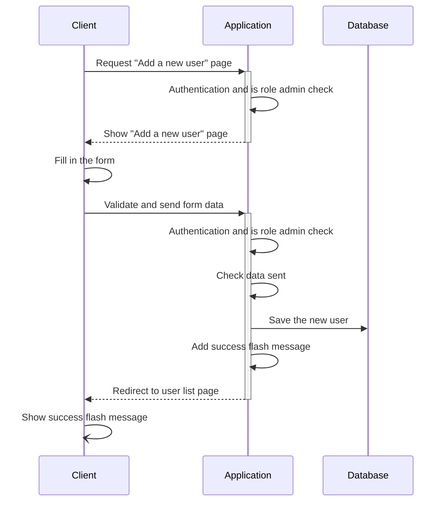

```mermaid
sequenceDiagram
    Client->>+Application: Request "Add a new user" page
    Application->>Application: Authentication and is role admin check
    Application-->>-Client: Show "Add a new user" page
    Client->>Client: Fill in the form

    Client->>+Application: Validate and send form data
    Application->>Application: Authentication and is role admin check
    Application->>Application: Check data sent
    Application->>Database: Save the new user
    Application->>Application: Add success flash message
    Application-->>-Client: Redirect to user list page
    Client-)Client: Show success flash message
```
