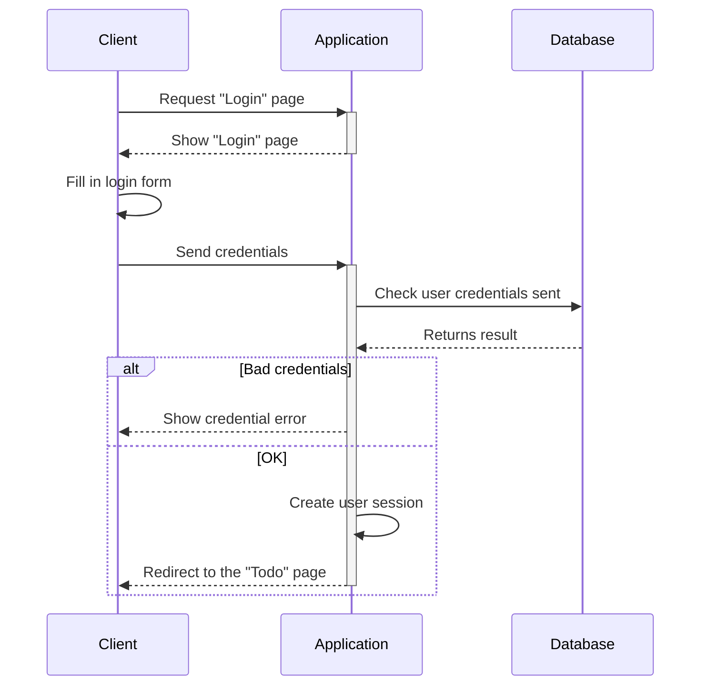

```mermaid
sequenceDiagram
    Client->>+Application: Request "Login" page
    Application-->>-Client: Show "Login" page
    Client->>Client: Fill in login form
    Client->>+Application: Send credentials
    Application->>Database: Check user credentials sent
    Database-->>Application: Returns result
    alt Bad credentials
        Application-->>Client: Show credential error
    else OK
        Application->>Application: Create user session
        Application-->>-Client: Redirect to the "Todo" page
    end
```
